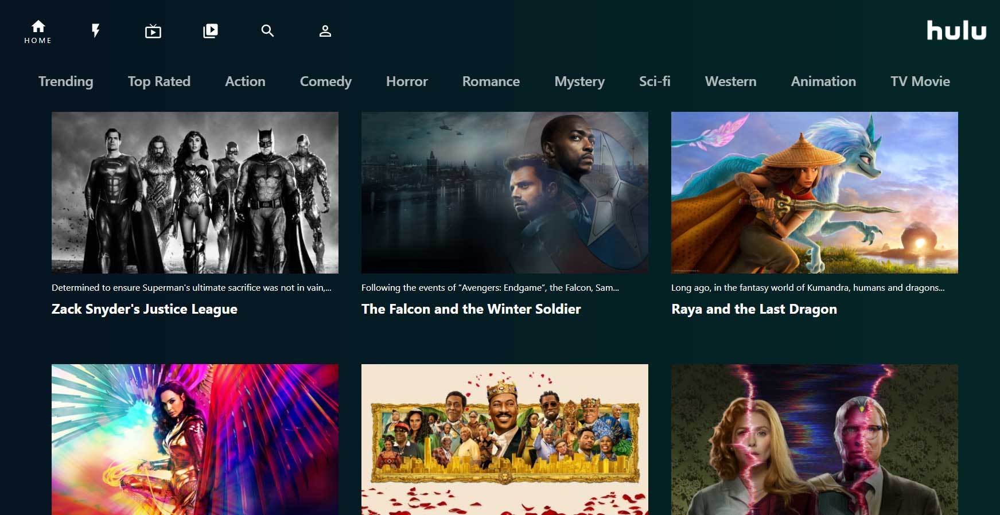

# Hulu Clone

This project was created with React and importing an external database.

## Made with React

This project was alot of fun and has some nice rollover animations and smooth scroll features built-in. Using axios to connect to external database and pull in the results to react app. Also used react flip move to create nice animations when clicking on top menu links. Looks like real app.

The final app can be viewed here  <a href="https://hulu-clone-8b239.web.app/"> Hulu clone</a>  - use back arrow to get back to this github page.

